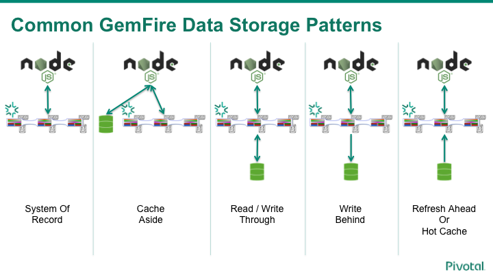

# Node GemFire

[](https://travis-ci.org/gemfire/node-gemfire)

This project brings GemFire an in-memory database to NodeJS.   GemFire can support a wide variety patterns and use-cases that range from caching to system of record.

#What is GemFire

GemFire is a highly avaible database that utilizes RAM/Disk/CPU in a distributed manner to provide a near-linear scale out performance.  GemFire's main data access pattern key-value while also supporting a rich query language that allows object traversal of the values in the query.  

## GemFire Features
**Predictable Low Latency** - Even during huge peaks in concurrent access, your users can count on predictable low latency because of the in-memory, horizontally scalable architecture of GemFire.

**Elastic Scale-Out** - Easily scale out horizontally to meet the most demanding peaks in usage. Scale back down again gracefully when the peaks are behind you. Keep your steady state runtime costs down.

**Real-Time Event Notifications** -
Your applications can subscribe to real-time events to react to changes immediately. GemFire’s continuous queries notify your application when new data is available, which reduces the overhead on your SQL database.

**High Availability and Business Continuity** - No more downtime from node failures, datacenter-wide outages, or software upgrades. GemFire nodes automatically fail-over in the event of a node-level outage, while its highly efficient WAN replication protocol enables multi-datacenter deployment for business continuity.

**Durability** - Eliminate data loss with GemFire’s in-memory data replication and a shared-nothing persistence architecture, providing unmatched data resiliency.

**Cloud-Ready** -
Available as a service on Pivotal Cloud Foundry, enable on-demand access to GemFire's high performance, highly available, event-driven data grid on the leading cloud-native application platform.


[Learn more about GemFire](https://pivotal.io/pivotal-gemfire)

## Patterns



**Caching** - in-memory databases  like GemFire allow applications to take advantage of a computers RAM to offer extreme performance over traditional disk based systems.   Even if those disk based systems are built on flash storage, in-memory provides a extreme number of input/output operations per second (IOPS).

**System of Record** - GemFire has a mature disk persistence capability that allows data to be written to disk.   This allows for applications that need durability in thier architecture.

**Cache Aside** - In the cache aside pattern the application instance controls how data is written to the cache.   Typically the application checks to see if the key/value is in the system.   If there is a miss the application retrieves the value from an operational data store.   Then stores the key/value for the next time it is needed.

**Read/Write Through** - by utilizing this pattern we can encapsulate the operational data store access within the GemFire servers.   This allows the application to focus on value added behavior.   Also allows GemFire to prevent operational concerns like the thundering herd problem.

This pattern can enable change data capture patterns in a synchronous manner.

**Write Behind** - In GemFire it has a powerful queuing mechanism that is highly avaible and durable that operates at in-memory performance and scale.   This allows GemFire to replicate data actions to an operational data store with a policy based on time or number of operations - which ever comes first.

This pattern can enable change data capture patterns in an asynchronous manner.

**Refresh Ahead or Hot Cache** - In this pattern we either write an application that bulk loads the data into GemFire.   As an alternative we can utilize the GemFire servers load the data in a parallel scale out manner using GemFire functions.

## Usage

Writing a GemFire application we first need to connect to the GemFire database.  In the following example we use a GemFire Cache Factory to programmatically create the connection parameters to the GemFire servers.   Followed up with creating a `CACHING_PROXY` cache to a region.


```javascript
var gemfire = require('gemfire');
// Create a Cache Factory so we can configure the connection details
var cacheFactory = gemfire.createCacheFactory();
// Add a locator which allows the system to dynamically discover GemFire data servers
cacheFactory.addLocator(host, parseInt(port));
// Instantiate the GemFire system connection.
var cache = cacheFactory.create();
// Create the region to do storage operations.
var region = cache.createRegion("myRegion", {type: "CACHING_PROXY"});

region.put('foo', { bar: ['baz', 'qux'] }, function(error) {
  region.get('foo', function(error, value) {
    console.log(value); // => { bar: ['baz', 'qux'] }
  });
});
```

For more information, please see the [API documentation](doc/api.md).

If you are using Cloud Foundry a sample can be [found here.](doc/cloud_foundary.md)

# Supported platforms

* Ubuntu 14.04 64-bit / ubuntu:trusty / cflinuxfs2 - Other 64-bit Linux platforms may work.  

# Tested NodeJS runtime versions

* 8.11.3

# Tested GemFire versions

* pivotal-gemfire-9.5.1
* pivotal-gemfire-native-client-9.2.0

# Installation

## GemFire Client Libraries

1. Download GemFire 9.2.0 Native Client Driver: [Pivotal Network Download](https://network.pivotal.io/products/pivotal-gemfire#/releases/51551).
2. Follow the installation instructions here: [GemFire Native Client Installation](http://gemfire-native.docs.pivotal.io/latest/gemfire/introduction/install-client.html)

## Installing the NPM package

Note that for the time being, if you want to be able to use the precompiled binary, you'll need to set `NODE_TLS_REJECT_UNAUTHORIZED=0` when running `npm install`. Otherwise, `npm install` will fallback to compiling from source, which may only work on certain platforms.

```
$ cd /my/node/project
$ NODE_TLS_REJECT_UNAUTHORIZED=0 npm install --save gemfire
```

## Configuring the GemFire client

By default the GemFire client will look for a `geode.properties` file in the current working directory.   This property file allows the developer to specify a variety of configuration settings.

[GemFire Properties](http://gemfire-native.docs.pivotal.io/latest/geode/setting-properties/propfile-attributes.html)


Here is an example file that turns off statistics collection, sets the "warning" log level, and redirects the log output to a file.

```
statistic-sampling-enabled=false
log-level=warning
log-file=log/gemfire.log
```

You can see the available options for `geode.properties` in the [GemFire documentation](http://gemfire-native.docs.pivotal.io/latest/geode/setting-properties/propfile-attributes.html).

As an alternative we can specify a propertiesFile using the the `gemfire.createCacheFactory("/path/to/geode.properties")`

# Driver Development

To enable linux Development the team uses a virtual environment to enable windows or mac developers to contribute.   To simplify setting up the linux guest OS  we use vagrant to provision the VM and install the appropriate OS and tools.

## Prerequisites

Install Vagrant 2.x or later to your choice of virtualization.

* [Vagrant 2.x or later](http://www.vagrantup.com/)

## Setup

Before we run `vagrant up` for the first time we have to download GemFire from Pivotal Network.   Download the following packages from [Pivotal Network](https://network.pivotal.io/products/pivotal-gemfire) and copy to <project>/tmp directory

* pivotal-gemfire-9.5.1.zip
* pivotal-gemfire-native-9.2.0-build.10-Linux-64bit.tar.gz

Once those are in place we can provision the vm and install all of the tools and GemFire by running `vagrant up` in the project directory.

To build the VM:
```
$ cd <project home>    
$ vagrant up
```
## Developer workflow

After the vagrant is all setup the project home is mounted in the VM as  `/vagrant`. You can make edits on the Host or on the VM since the directory is shared.  

**To ssh into the VM use the vagrant command:**
```
$ vagrant ssh
```
**Change to the project home once ssh'd into the VM:**
```
$ cd /vagrant
```
**Build the CPP code use grunt**
```
$ grunt
```

**GemFire Server Management**
The GemFire server should be automatically started for you as part of the above tasks. If you need to restart it manually, use the following:
```
$ vagrant ssh
$ grunt server:restart # or server:start or server:stop
```

# Contributing

Please see [CONTRIBUTING.md](CONTRIBUTING.md) for information on how to submit a pull request.

## License

BSD, see [LICENSE](LICENSE) for details

For dependency licenses, see [doc/dependencies.md](doc/dependencies.md)
